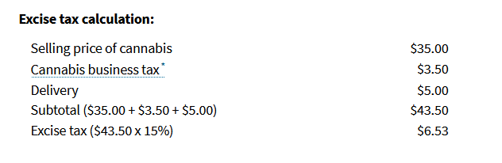

When calculating the California Cannabis Excise tax, we first need to determine the type of transaction that is taking place. Distributors are the ones that remit Cannabis Excise tax, and they conduct two types of transactions: Non-Arm's-length and Arm's length.\
***\*Non-Arm's-length** simply means that the distributor and the retailer **are related** parties. In this type of transaction, the taxable base is your retail price. The CDTFA website gives a detailed explanation of this calculation [here](https://www.cdtfa.ca.gov/industry/cannabis.htm#Distributors)

 This is a screenshot of the CDTFA calculation, which seems to be pretty straight forward:

As you can see in the above picture, the Excise tax is also levied onto the City tax.  I believe that the CDTFA website is wrong since the [Revenue and Taxation Code Section 6102](https://www.cdtfa.ca.gov/lawguides/vol1/sutl/6012.html) explicitly states that City tax should not be taxed. 

(5)")

In my opinion, the Excise tax calculation for related parties is the following:

**(Sales price +delivery+safety-promotions) * 15%**