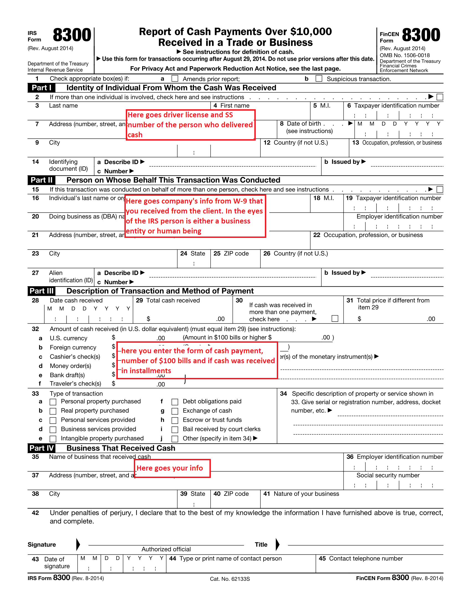

So.. you got paid in cash. What now? Well, first of all, spend it wisely.  Second of all, make sure you comply with the IRS cash reporting requirements. 

The IRS combats money laundering and wants to track any large movements of cash. A person that received a large amount of money may be required to file form 8300.

**Question:** In what cases am I required to submit form 8300?
**Answer**: Whenever you receive 10k as a lump sum. Or when you accept smaller amounts, they amount to 10k, and you received them within 24 hours. You should also file the form if you receive cash within 12 months, and each payment is a part of the same deal. 
Also, only business transactions need to be reported. One-time personal payments do not have a reporting requirement.

**Question:** What do I consider cash?
**Answer:** Money, cashier checks, money orders, and bank drafts are considered cash. A personal check connected to the buyer’s bank account is not cash, and you don't have to report it.

**Question:** What's the deadline?                                                                                                                                          **Answer:** You are required to file the form within 15 days from a transaction. You will pay $270 (as of 2020) if you forget to submit the form. Penalties for intentional late filing are much higher and include criminal sanctions.

**Here are some tips that will help you to file your first form 8300:**
**Collect buyers information:**
Before the meeting, inform your client that you will need the following documents: 

1. ID (driver license will do) and SS number of the person delivering the cash. It is enough to take a picture of both documents.
2. Form W-9 for the business entity. This paper does not get filed with the IRS. The buyer fills out and signs this form for your records.

It is crucial to collect this information before or during a sale. In my experience, there is very little chance that the buyer would be willing to provide the information after your meeting is over. Filing responsibility is on you and not on the buyer and the buyer has no incentive to provide you with their personal information. 

3. Make sure to record how many $100 bills were in the payment. This information goes in Part III of the return.

   

   **What to do if the client is not responding?**                                                                                                                  If you cannot get all of the necessary information from your buyer, try to do your best. Contact the client in a written form and ask again. If the client refuses to communicate or ignores your attempts, keep a copy of all of your communication. This will be proof of your compliance. Complete form 8300 with the information you have on file, and attach a statement explaining your attempts to collect the missing data.

   **How to file:**
   You can file this form online or send it via mail. If mailing to the IRS, remember that the day of filing is the day you mailed the envelope. So, if you post the form precisely 15 days after the transaction, you will be in good shape as long as you keep proof of mailing. 

   **Statement to the buyer:**
   By January 31st, you will have to furnish your client with a statement that informs them of your 8300 form filings activity. The report is in free form but should include the following information:  contact information of both parties, the total amount of reportable cash in the past year, and notification that the company provided the information mentioned above to the IRS.
   The IRS imposes enormous penalties for failure to provide statements to buyers. So, make sure that you send them out by the end of January.

   I think that's about it. You can read up on details here:  https://www.irs.gov/pub/irs-pdf/p1544.pdf

   Daria